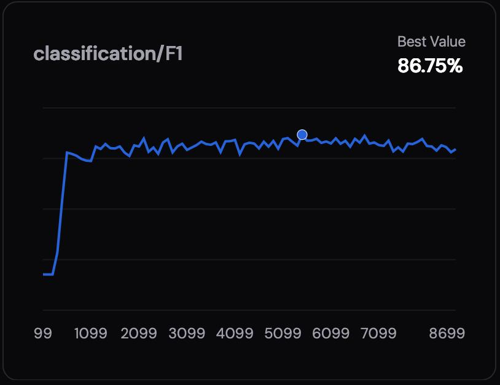
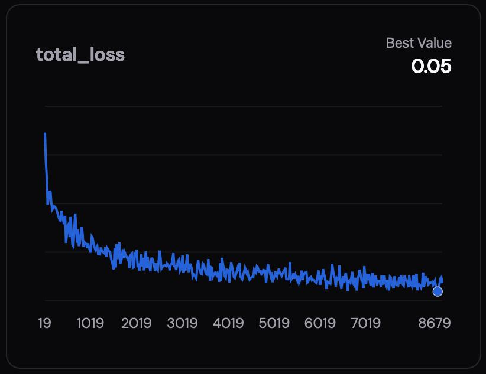

<h1 align="center">  Low Power Space Debris Monitoring</h1>


## Overview

The main objective is to tackle the issue of space debris by developing a multi-class classification model to increase debris awareness, space pollution mapping and eventually collision avoidance.

Our solution is low power, low cost and with a low bandwidth usage, specifically designed to be implemented efficiently on a cubesat. 


## Quickstart

### 1. Clone the repository
```bash
git clone https://github.com/TinyHack-Group-8/project.git
cd project
```

### 2. Train you model and do quantization
Follow the notebook [model_example.ipynb](notebooks/model_example.ipynb) to load, quantize and then test your model. 

### 3. Deploy the model

Drag the quantized model `.onnx` file inside the `src/` directory. This will generate the library, build and flash it on the Nicla connected on the serial device specified in `~/pipeline/vars.sh`.

Run the pipeline (make sure your tensor shapes , in the root dir:
```bash
make
```

### 4. Run Flask server and React client

At last, in order to access the dashboard, and save the serial communication with the Nicla. You can build the frontend and serve the backend with the following commands:


```bash=
make build-frontend
make serve
```


## Technical description


### Model training and quantization
The space debris dataset used for the project can be found at [roboflow debris dataset]("https://app.roboflow.com/yolo-fa1pr/space-debris-detection-with-none-class-lyhju/").

The model is a fine tuned version of ```fai-cls-n-coco``` from [Focoos.ai]("https://focoos.ai/") trained directly on their platform using the following hyperparameters for the training


| Hyperparameter | Value |
| -------- | -------- |
| Batch Size     | 8     |
| Learning Rate     | 0.00025     |
| Optimizer     | AdamW     |
| Scheduler     | Cosine     |
| Patience     | 32     |
| Weight Decay     | 0.00068     |
| Epochs / Max Iters     | 12400     |
| Input Resolution     | 96x96     |
| Augmentations     | Flip 0.4, Rotation 0.1     |

Following the instruction from [model_example.ipynb](notebooks/model_example.ipynb) you can load your model from Focoos training hub and then export to ```.onnx``` format. Then the model can be quantized. In the notebook you can also test your quantized model with a test set.

You can see the loss of the model and the F1 score in the picture below:

F1 Score             |  Loss of the Model
:-------------------------:|:-------------------------:
  |  

### Deployment and firmware

It is possible deploy the quantized model dragging the `.onnx` file inside the `src/` directory.

We will use [Zant](https://github.com/ZantFoundation/Z-Ant) to flash, this is can easly done with the `pipeline/codegen.sh`. 

After that you can execute `pipeline/build.sh`, where you can change the CPU target and the type of model optimization.

At the end, the `pipeline/flash.sh`, will compile and flash the **Arduino    Nicle Vision XIP** through *arduino_cli*

Here the tree of the firmware of the Nicla Vision:
```
lib
├── build
├── custom.ld
├── flash_nicla_xip.sh
├── lib.ino
└── ZantLib
```

Inside the lib.ino there is the *firmware* of the Nicla, where it is possible to code some specific preprocessing with the aim to enhance image recognition.

Also here is implemented the serial communication between the Flask server which will receive information about the classification and source image.


### Dashboard

The frontend is based on React through Vite, which gets built statically, check the pipeline above for more details on how to do it. The 3D Globe model was made thanks to `react-globe.gl` which uses Three.js and WebGL, which gives it that snappy feeling.

We've decided to use a very thin web server for our communications: flask. This allows us to collect and store data directly from the Nicla through a serial channel. It also serves a RESTful API and the frontend.

Ta da 🎉! You should be able to access the webserver through `http://127.0.0.1:5000`.

> Note: If you want the server to access through other hosts, you should change the HOST value in the `backend.py`.


## Contributors

- [@KokkuApples](https://github.com/KokkuApples) - Federico Mele
- [@pasc4le](https://github.com/pasc4le/) - Giuseppe Pascale
- [@Paolo410](https://github.com/Paolo410) - Paolo Malugani
- [@Sampli1](https://github.com/Sampli1) - Sandro Marghella


## Project Structure

Most of the builds will be exported in the `dist` folders.

```
├── pipeline
│   ├── build.sh
│   ├── clean.sh
│   ├── codegen.sh
│   ├── flash.sh
│   └── vars.sh
├── README.md
└── src
    ├── backend
    ├── frontend
    ├── lib
    ├── model
    ├── model_info.json
    └── model.onnx
```
