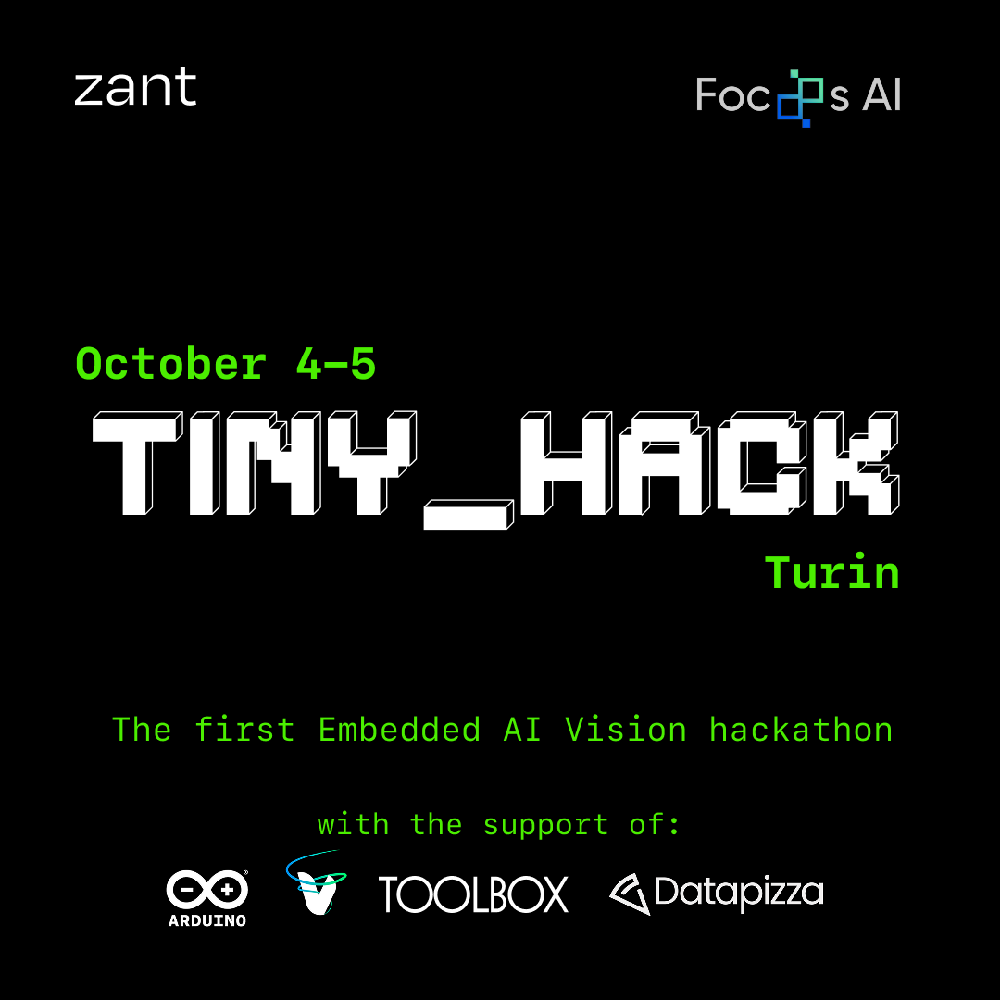

<div align="center">
  
</div>

# The Challenge

**Duration:** 24 hours

Build a creative computer vision application using:
- **Focoos** platform for model training
- **ONNX** export format with quantization library
- **Arduino Nicla Vision** as deployment target
- **Zant** for flashing your model

**Use Case:** Any computer vision application - we'll reward your creativity! 🎨

---

# Submission Requirements

Submit via **Pull Request** to this repository

### Required Files
- `.ino` Arduino sketch
- `.onnx` model file
- `model_info.json` metadata
- `README.md` documentation
- anything relevant (web pages, mobileapp, images, examples ...)
- **5 slides** presentation deck (`.pdf`)
  - Use the Google Slides template [here](https://docs.google.com/presentation/d/1c1S4XClzACHqEn-09ESwnSicXFq4gekJ_8vndtCpdOI/edit?usp=sharing): `File → Make a Copy → Entire Presentation`

### Folder structure
```
team-number-project-name/ (example: 7-cool-object-detection)
├── src/
│   ├── sketch.ino               # Arduino sketch
│   ├── model.onnx               # ONNX model
│   ├── model_info.json          # Model metadata
│   └── ...                      # (optional) Additional relevant files (web pages, mobile app, etc...)
│
├── docs/
│   ├── README.md                # Extended documentation (setup, usage, pipeline, etc.)
│   └── other-guides.md          # (optional) additional guides or docs
│
├── slides/
│   └── presentation.pdf         # Presentation deck
│
└── README.md                    # Main project readme (overview + quick start)
```

### Selection Process:
- ✅ All submissions reviewed
- 🎤 Top 5 teams selected for live demo
- 🏆 3 winning teams announced

# 🏆 Award Categories 🏆

## 🌟 Impact Trophy
*Most innovative and original application concept*

## 💻 Clean Code Champion
*Best code quality, documentation, and software engineering practices*

## 🚀 Technical Trophy
*Most technically impressive or groundbreaking implementation*

# 🏆 Winners 🏆

1. [MelaNoMore](./submissions/5-melanomore)

2. [SpaceDebris](./submissions/8-space-debris)

3. [CineCla](./submissions/4-cinecla) & [MoodSip](./submissions/1-moodsip)

You can check out all the amazing projects [here](./submissions).

# Some Food for Thought

As you build your solution, here are some aspects worth considering:

**On Data & Models**
- How did you choose your dataset? Edge AI has unique constraints that might influence what data works best
- Why did you pick that specific model architecture? Sometimes smaller is better... 😉
- Have you thought about the trade-offs between accuracy and efficiency for your particular use case?

**On Performance & Deployment**
- Getting your model running on actual hardware is just the beginning - does it run fast enough for what you're trying to do?
- A surveillance system might need different framerates than a periodic quality checker
- What if some of the all computation didn't happen on the device? Pre-processing, post-processing, or complementary algorithms could live elsewhere

**On Integration & User Experience**
- The Nicla Vision can communicate with other systems - how reliable is your connection?
- Could you visualize your system's output in a way that anyone could understand, not just developers?
- Have you explored what other sensors the Nicla Vision has beyond the camera? IMU, microphone, environmental sensors...

**On Going Further**
- What if you ran more than one model? The hardware might surprise you with what it can handle
- Think about the full pipeline: what happens before and after your model runs?
- How would someone without technical knowledge interact with your system?

---

## 🛠️ Resources

- **Focoos Platform:** Model training & export
- **Zant Tool:** Model deployment to hardware
- **Arduino Nicla Vision:** Edge AI hardware platform

See the [`docs/`](./docs) folder for tutorials, troubleshooting, and additional resources 

---  

Good luck, and remember: **creativity counts!** 🎉
