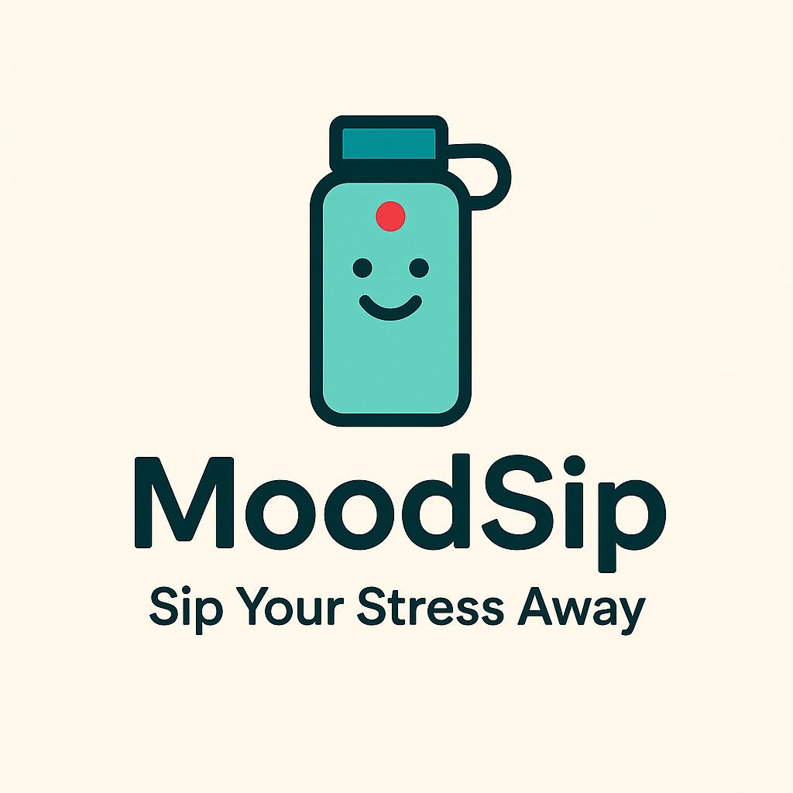

# MoodSip - Sip Your Stress Away 🌟

**MoodSip** is a smart water bottle developed by **[@pitadagosti](https://github.com/pitdagosti), [@davmacario](https://github.com/davmacario), and [@FrigaZzz](https://github.com/frigazzz)**.
It integrates an **Arduino Nicla Vision** to adapt your hydration rhythm to your needs, combining **water tracking** and **emotion detection** 💆.

Studies show that even mild dehydration can reduce concentration, cause fatigue, and irritability [1]. Proper hydration can reduce cortisol spikes under stress [2] and improve physical and mental well-being [3].

MoodSip helps you **drink smarter and manage stress**, promoting both physical and mental health [4].

## Hydration Matters 💧

Fluid loss negatively affects the body:

- **Common symptoms:** fatigue, confusion, reduced physical and mental performance 🧠 [5]
- **Elderly:** dehydration is widespread, increasing mortality and healthcare costs 🧑‍🦳 [6]
- **Stress:** even mild water deprivation amplifies stress response with higher cortisol peaks 💹 [2]

Benefits of proper hydration [7]:  
- Prevents headaches
- Reduces fatigue
- Improves skin and cognitive performance

Technology can support regular hydration habits. Current smart bottles remind you to drink and track intake, but rarely consider **emotional state**. MoodSip fills this gap with a **holistic daily wellness approach**.

## Existing Solutions 🤖

**HidrateSpark PRO** [8]

- SipSense sensors weigh the bottle and track every sip
- Bluetooth app with personalized goals
- Bottle lights up when it’s time to drink
- Focus: quantitative hydration tracking

**REBO SMART** [9]

- Tracks personalized hydration via Bluetooth and app
- Environmental impact: "1 REBO drank = 1 plastic bottle collected from oceans"
- Digital reminders and hydration plans based on activity and body
  
**Other Examples** [10]

* They can remind you to drink enough water and track how much you drink  
* Some models even include **speakers**, **UV sterilization**, or **fitness connectivity**.  

**Limitations:**

- Most focus on **water quantity and notifications**
- None integrate **emotion detection**

MoodSip bridges this gap by combining **hydration tracking** and **mood sensing** for a personalized experience.

## How MoodSip Works 🌡️😊

MoodSip runs an **adaptive timer** based on:

### 1. Facial Expressions (Stress)

- **Nicla Vision camera** captures the user’s face
- ML model (FocoosAI) detects signs of stress (e.g., furrowed brows, tired eyes)
- If stress is detected, the LED turns **red 🔴** and the drinking reminder accelerates

### 2. Ambient Temperature

- Sensor measures temperature and humidity
- In hot or humid conditions, the timer shortens to encourage more frequent drinking

### 3. Drinking Duration

- LED turns **blue 🔵** when it’s time to drink
- Proximity and gyroscope sensors estimate water intake
- If intake is low, the next timer is shortened to encourage proper hydration

**Summary:** MoodSip continuously adapts drinking reminders based on stress, temperature, and actual water intake. Everything runs on **Arduino Nicla Vision**, completely offline.  
A [video presentation can be seen here](https://youtu.be/YI3l9gEI9GM).

**Try out our [APP](http://10.100.16.79:3001)!**

## Technical overview

For the technical overview, see [here](./docs/README.md).

## Technologies ⚙️

- **Arduino Nicla Vision:** 2MP camera, proximity sensors, 6-axis gyroscope/accelerometer, Wi-Fi/BLE
- **Focoos AI:** computer vision library for facial expression recognition
- **Z-Ant:** open-source framework to optimize neural models on microcontrollers

**Advantage:** onboard intelligence, portable, and fully offline.

## Impact & Benefits 👍🏼

MoodSip is more than a gadget:

- **Promotes public health:** encourages hydration and stress management
- Supports elderly, professionals, and athletes
- Raises awareness of mind-body connection: drinking water can relieve mental tension

Compared to other smart bottles, MoodSip is more **holistic**: it doesn’t just count milliliters—it “understands” the user.
Potentially reduces dehydration-related medical visits and improves daily life and performance.

## Alcoholic Games? Yes please! 🎲🍺

MoodSip can turn into a **party drinking game**:

- Everyone keeps a poker face
- Camera detects smiles or other emotions
- **Red LED 🔴** lights up for the “caught” person → that player takes a sip

Uses the same emotion detection mechanism for fun and social interaction.

## References 📚

[1]. [Dehydration: the enemy of our body](<https://medimutua.org/disidratazione-il-nemico-del-nostro-organismo/>)  
[2]. [Relationship between fluid intake, hydration status and cortisol dynamics in healthy, young adult males](https://www.sciencedirect.com/science/article/pii/S2666497624000572)  
[3]. [The Science of Nano-Enhanced Hydration in Sports Nutrition](https://link.springer.com/chapter/10.1007/978-981-96-5471-0_3)  
[3]. [This Simple Everyday Health Tweak Can Help Reduce Anxiety And Future Health Problems](https://www.womenshealthmag.com/health/a68130438/hydration-stress-anxiety-study/)  
[4]. [Socials and streamings compromise hydratation causing failures in exams](https://www.okmedicina.it/index.php?option=com_community&view=groups&task=viewbulletin&groupid=65&bulletinid=10897&Itemid=109)  
[5]. [Trends in Dehydration in Older People](https://www.mdpi.com/2072-6643/17/2/204)  
[6]. [Dehydratation Symptoms](https://www.my-personaltrainer.it/disidratazione-sintomi.html)  
[7]. [HidrateSpark PRO](https://hidratespark.com/?srsltid=AfmBOooQmVp6rp2yZDZgBH_fBYdvN3JowtpO-y11takX4Zvbfby2JB8P)  
[8]  [REBO SMART](https://www.rebo-bottle.com/?srsltid=AfmBOoqhUXy9-czE509IICU5Ty_-udnFqgqxLnc0WFIuFZnrFpd2PKXt)  
[9] [5 Best Smart Water Bottles of 2024](https://www.goodhousekeeping.com/home-products/g37094301/best-smart-water-bottles/)  
