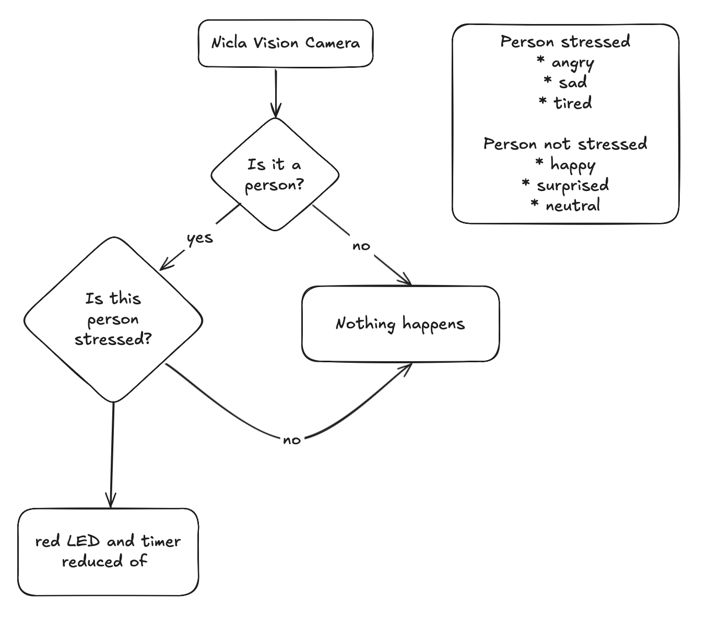

# **MoodSip – Project Specifications**

## 1. Introduction

### 1.1 Project Purpose

MoodSip is an **intelligent hydration assistant** designed to encourage optimal water intake through emotion-aware interactions.
It leverages the **Arduino Nicla Vision** board to combine computer vision, environmental sensing, motion detection, and ambient temperature monitoring.
Using AI-based emotion recognition, it provides **proactive hydration reminders** based on the user’s psychological and physiological state.

### 1.2 Main Objectives

* Monitor the user’s presence and emotional state in real time.
* Suggest optimal hydration moments based on environmental and emotional data.
* Detect when the user lifts or tilts the bottle to confirm a drinking action.
* Adjust reminder frequency based on mood and stress indicators.

## 2. System Overview

### 2.1 Usage Context

The user places the bottle on a desk during work.
The system initializes an **internal hydration timer**, which accounts for:

* ambient temperature;
* duration since the last drinking action.

When the timer expires, the **blue onboard LED** on Nicla Vision flashes to prompt hydration.
If MoodSip detects negative emotions (e.g., stress, sadness, fatigue), the timer interval is **shortened dynamically** to encourage earlier water intake.

### 2.2 Drinking Action Detection

The onboard accelerometer detects **lifting and tilting motions**, confirming that the user has drunk from the bottle.
Detection resets the hydration timer.

## 3. System Architecture

### 3.1 Overview

The architecture integrates both **edge** and **cloud** AI components for balanced efficiency:

1. **Onboard Processing** – Conducted locally on the Arduino Nicla Vision using optimized, quantized vision models.
2. **Cloud Processing (Companion App + Remote AI)** – High-performance emotional analysis handled remotely through BLE connectivity.

### 3.2 Component Diagram

*To be defined – include a high-level block diagram illustrating the connections among camera, sensors, BLE module, and cloud API.*

## 4. Facial Expression Analysis

### 4.1 Two-Stage Structure

| Stage                             | Description                                                                                                                                                                                                       | Technologies                  |
| --------------------------------- | ----------------------------------------------------------------------------------------------------------------------------------------------------------------------------------------------------------------- | ----------------------------- |
| **1. Local Monitoring**           | The Nicla Vision camera continuously observes the user and analyzes the surrounding environment. The onboard classification model detects if the user is present and positioned near the bottle.                  | **Focoos AI SDK**, **Z-Ant**  |
| **2. Emotional Analysis (Cloud)** | When paired with the Companion App, a cloud-based AI model (Gemini 2.5 Flash) performs deeper analysis of facial expressions to assess emotional states and determine if an early hydration reminder is required. | **Gemini 2.5 Flash**, **BLE** |

### 4.2 Training Datasets

* **MIT Indoor Scene Recognition Dataset** (via Roboflow)
* **Celebrity Face Image Dataset** (via Kaggle)

*Additional dataset augmentation and normalization details TBD.*

### 4.3 Communication

BLE is used to exchange:

* presence and stress detection results;
* hydration timer state;
* user acknowledgment of prompts.

## 5. Technical Implementation

### 5.1 Vision Model

* Trained using **Focoos AI SDK**.
* Quantized to **8-bit precision** for efficient embedded inference.
* Deployed on Nicla Vision via **Z-Ant Deployment Toolkit**.
* Model inference time: *TBD (approx. 200–400 ms/frame)*.

### 5.2 Software Stack

| Layer                 | Technology       | Primary Function                             |
| --------------------- | ---------------- | -------------------------------------------- |
| **Firmware**          | Arduino IDE      | Sensor logic, LED control, BLE communication |
| **Computer Vision**   | Focoos AI SDK    | User and scene detection                     |
| **Vision Deployment** | Z-Ant            | Optimized deployment of quantized models     |
| **Cloud AI**          | Gemini 2.5 Flash | Emotion recognition and stress inference     |

## 6. Functional Requirements

| ID    | Requirement                                                        | Priority | Verification Method      |
| ----- | ------------------------------------------------------------------ | -------- | ------------------------ |
| FR-01 | Detect user presence within 2 seconds of camera activation.        | High     | Real-time testing        |
| FR-02 | LED must flash for 5 seconds when hydration reminder is triggered. | Medium   | Visual inspection        |
| FR-03 | BLE connection must transmit data packets every 10 seconds.        | High     | BLE log analysis         |
| FR-04 | Timer must decrease by 30% upon stress detection.                  | High     | Model simulation         |
| FR-05 | System must reset timer upon drinking detection.                   | High     | Accelerometer event logs |
| FR-06 | User emotion classification accuracy ≥ 85%.                        | High     | Dataset benchmark        |
| FR-07 | Ambient temperature sampling every 30 seconds.                     | Medium   | Sensor output log        |

## 7. Non-Functional Requirements

| Category              | Requirement                                                          |
| --------------------- | -------------------------------------------------------------------- |
| **Performance**       | Emotion inference latency < 500 ms/frame.                            |
| **Energy Efficiency** | Average consumption < *500 mW (TBD)*.                                |
| **Reliability**       | False positive rate in face detection < 10%.                         |
| **Maintainability**   | OTA or USB firmware updates supported.                               |
| **Scalability**       | Cloud AI must support at least *1000 concurrent users (TBD)*.        |
| **Security**          | BLE connection encrypted using AES-128.                              |
| **Privacy**           | No image storage; only anonymized feature vectors sent to the cloud. |
| **Usability**         | LED notifications must be visible under standard office lighting.    |

## 8. Hardware and Software Requirements

### 8.1 Hardware

* Arduino **Nicla Vision Board**
* Integrated camera module
* 6-axis accelerometer and gyroscope
* Temperature sensor
* RGB LED
* *Power source (battery or USB-C, TBD)*
* *Optional: environmental humidity sensor*

### 8.2 Software

* Arduino IDE (Firmware)
* Focoos AI SDK (Model training)
* Z-Ant (Model deployment)
* Gemini 2.5 Flash (Cloud inference)
* BLE API (Device communication)
* *Companion App framework: TBD (Flutter / React Native / Kotlin)*

## 9. Communication and Interfaces

### 9.1 BLE Protocol Specification

| Element              | Description                                                |
| -------------------- | ---------------------------------------------------------- |
| **Service UUID**     | *TBD – Hydration Service (custom)*                         |
| **Characteristics**  | Hydration Timer, Emotion State, Temperature, Device Status |
| **Data Format**      | JSON or binary (TBD)                                       |
| **Update Frequency** | 10 seconds                                                 |
| **Encryption**       | AES-128, BLE 5.0 compliant                                 |

### 9.2 Cloud API

* Endpoint: *TBD (Gemini API or custom microservice)*
* Data exchanged: anonymized emotion features and temperature context.
* Response: stress probability and hydration adjustment recommendation.

## 10. System Operation Flow

1. Power on and BLE connection established.
2. Camera detects user presence.
3. Timer starts and tracks hydration interval.
4. Emotion analysis performed (onboard + cloud).
5. Timer dynamically updated based on stress level.
6. LED prompts hydration reminder.
7. Accelerometer confirms drinking event → timer reset.

*Detailed flowchart TBD.*
